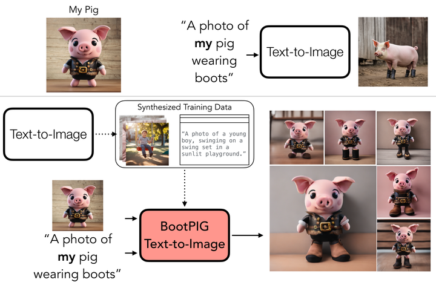

# BootPIG: Bootstrapping Zero-shot Personalized Image Generation Capabilities in Pretrained Diffusion Models

<p align="center">

</p>

This repository contains code to accompany the following paper:
[BootPIG: Bootstrapping Zero-shot Personalized Image Generation Capabilities in Pretrained Diffusion Models](https://arxiv.org/pdf/2401.13974.pdf)
[Senthil Purushwalkam](https://www.senthilpurushwalkam.com/), [Akash Gokul](./), [Shafiq Joty](https://raihanjoty.github.io/), and [Nikhil Naik](https://web.mit.edu/naik/www/).
arXiv preprint arXiv:2401.13974 (2024).


## Installation

Create a clean Anaconda environment and install all the dependencies using the following commands:
```
conda create -n bootpig python=3.9
conda install pytorch torchvision torchaudio pytorch-cuda=12.1 -c pytorch -c nvidia
conda install -c conda-forge diffusers accelerate transformers
pip install hydra-core tqdm --upgrade
pip install -U git+https://github.com/luca-medeiros/lang-segment-anything.git
# LangSam breaks huggingface hub version, need to re-install 
pip install huggingface_hub -U 
pip install openai==0.28.0
```

## Data Synthesis

Training of Bootpig requires synthesized data. We have included a script to generate the relevant data. You can run the generation using:
```
python data_synthesis/generate_data.py --out_dir <location to store images>
```


# Training a Bootpig model

Train a Bootpig model using the following command:

```
accelerate launch --num_processes=16 train_bootpig.py logging.name=bootpig_release exec.data_dir=<path_to_generated_data> logging.output_dir=<path_to_save_models>
```


# Inference using Bootpig

Checkout [inference_notebook.ipynb](inference_notebook.ipynb) for usage of the trained model.
